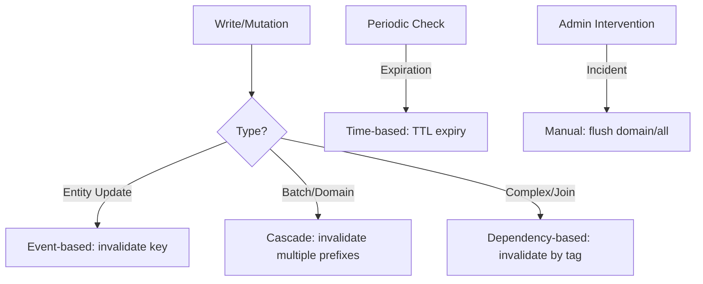

# Caching Strategy & Architecture

This document outlines the comprehensive caching strategy for the Chioma backend. The goal is to maximize performance, reduce database load, and ensure data consistency through a multi-tier caching architecture.

## 1. Cache Types

The system supports three primary caching strategies based on the environment and deployment model:

| Type                  | Environment        | Provider                | Use Case                                                                           |
| :-------------------- | :----------------- | :---------------------- | :--------------------------------------------------------------------------------- |
| **In-Memory**         | `test`             | `@nestjs/cache-manager` | Local unit/integration testing without external dependencies.                      |
| **Traditional Redis** | `staging` / `prod` | `ioredis`               | Dedicated Redis instances or managed Redis (e.g., ElastiCache).                    |
| **Serverless Redis**  | `prod` (Render)    | `@upstash/redis`        | Serverless environments or globally distributed edge caching via Upstash REST API. |

## 2. Redis Setup & Configuration

The cache store is automatically selected at startup in `AppModule`.

### Environment Variables

| Variable         | Description                     | Example                               |
| :--------------- | :------------------------------ | :------------------------------------ |
| `REDIS_URL`      | Upstash REST URL (Serverless)   | `https://name-region-1234.upstash.io` |
| `REDIS_TOKEN`    | Upstash REST Token (Serverless) | `AZ...`                               |
| `REDIS_HOST`     | Redis Host (Traditional)        | `localhost` or `redis.internal`       |
| `REDIS_PORT`     | Redis Port (Traditional)        | `6379`                                |
| `REDIS_PASSWORD` | Redis Password                  | `************`                        |
| `REDIS_TLS`      | Enable TLS (true/false)         | `true`                                |

### Connection Logic

1. If `REDIS_URL` and `REDIS_TOKEN` are present, the **Upstash Store** is initialized.
2. Otherwise, if `REDIS_HOST` is present, the **ioredis Store** is initialized.
3. Fallback to **In-Memory Store** if no Redis variables are set.

---

## 3. Cache Key Design

Consistent key naming is critical for effective invalidation and observability.

### Naming Conventions

- **Namespace**: Use semantic prefixes separated by colons (`:`).
- **Case**: Always use lowercase.
- **Identifiers**: End with a UUID, ID, or MD5 hash of the query parameters.

### Key Patterns (Constants in `cache.constants.ts`)

| Domain          | Pattern                    | Example                    |
| :-------------- | :------------------------- | :------------------------- |
| **Properties**  | `property:{id}`            | `property:abc-123`         |
| **Listings**    | `properties:list:{hash}`   | `properties:list:d41d8cd9` |
| **Search**      | `search:properties:{hash}` | `search:properties:a1b2c3` |
| **Suggestions** | `suggest:{hash}`           | `suggest:xyz`              |
| **Locks**       | `lock:{resource}:{id}`     | `lock:payment:789`         |

> [!TIP]
> For complex query objects (filters, pagination), always canonicalize and MD5 hash the object to generate a stable cache key.

---

## 4. Invalidation Strategies

We employ five distinct invalidation patterns to maintain consistency.



### 1) Time-based (TTL)

The primary safety net. Entries expire automatically.

- **Used for**: Data that tolerates slight staleness (Search results, listings).

### 2) Event-based

Immediate invalidation after a successful database write.

- **Used for**: Single entity detail pages (`property:{id}`).

### 3) Dependency-based (Tags)

Entries are registered with "tags" (e.g., `user:123`, `property:*`). Invalidation of a tag clears all associated keys.

- **Implementation**: Handled by `CacheService.getOrSet` options.

### 4) Cascade Invalidation

A specialized utility `invalidatePropertyDomainCaches(id)` that clears:

- Search results
- List pages
- Autocomplete suggestions
- The specific entity entry

### 5) Manual Invalidation

Admin endpoints for manual cache purging.

- **Endpoint**: `POST /api/cache/invalidate` (Internal/Admin only).

---

## 5. TTL Configuration (Time-to-Live)

TTLs are defined in milliseconds in `cache.constants.ts`.

| Category           | TTL       | Constant                      |
| :----------------- | :-------- | :---------------------------- |
| **Hot Listings**   | 5 Minutes | `TTL_PUBLIC_PROPERTY_LIST_MS` |
| **Search Results** | 2 Minutes | `TTL_SEARCH_RESULTS_MS`       |
| **Suggestions**    | 5 Minutes | `TTL_SUGGEST_MS`              |
| **Detail Views**   | 1 Hour    | `TTL_PROPERTY_ENTRY_MS`       |
| **Static Data**    | 24 Hours  | `TTL_STATIC_DATA_MS`          |

---

## 6. Monitoring & Performance

### SLO-Oriented Targets

- **Hit Rate**: Target > 85%.
- **Latency (P99)**: < 15ms for Redis reads.
- **Eviction Rate**: Stay below 1% of total operations.

### Monitoring Endpoint

`GET /api/cache/stats` results include:

```json
{
  "hits": 1240,
  "misses": 88,
  "hitRate": 0.934,
  "missRate": 0.066,
  "dependencyTrackedKeys": 47
}
```

### Performance Patterns

- **Cache-Aside**: Use `getOrSet()` to ensure "read-through" consistency.
- **Stampede Protection**: `CacheService` implements single-flight deduplication — concurrent requests for the same missing key will only result in **one** database query.
- **Cache Warming**: `PropertyCacheWarmingService` pre-loads hot listings into Redis during system startup and via periodic cron jobs.

---

## 7. Troubleshooting

| Symptom              | Probable Cause              | Fix                                                       |
| :------------------- | :-------------------------- | :-------------------------------------------------------- |
| **Stale Data**       | Missing ivalidation call    | Add `invalidate` to Service mutation methods.             |
| **Low Hit Rate**     | High cardinality keys       | Hash normalized query objects; increase TTL.              |
| **High Latency**     | Redis connection saturation | Check pool size; verify network proximity (TLS overhead). |
| **Cache Miss Storm** | Expiring hot keys           | Increase TTL or enable Warming for hot paths.             |

---

## 8. Caching Checklist for Developers

When adding a new cached feature, ensure:

- [ ] Is the cache key defined in `cache.constants.ts`?
- [ ] Are you using the `@Cached` decorator or `cacheService.getOrSet`?
- [ ] Does the write path (create/update/delete) call `invalidate`?
- [ ] Is the TTL appropriate for the data's volatility?
- [ ] Are dependency tags registered for aggregate data?
- [ ] Did you verify the hit rate in the dev environment?

---

## 9. Best Practices

1. **Never cache PII**: Avoid storing sensitive personal data or passwords in plain Redis.
2. **Standardize Prefixes**: Use the defined naming system to avoid key collisions.
3. **Atomic Writes**: Always update the database **before** invalidating the cache.
4. **Graceful Degradation**: The application must continue to function if Redis is unavailable (handled by `CacheService` internal error catching).
5. **Short TTLs by Default**: Start with conservative TTLs (1–5 mins) and increase only after profiling.
